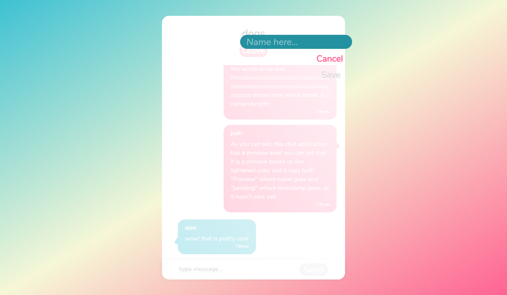
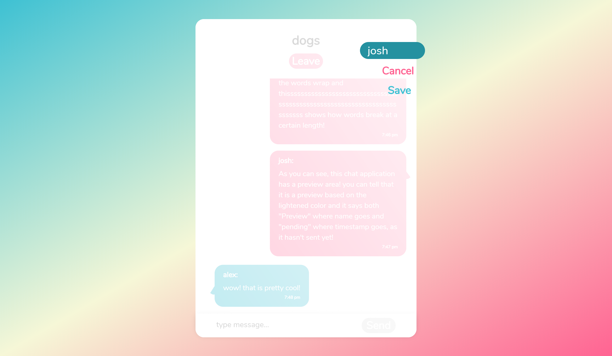
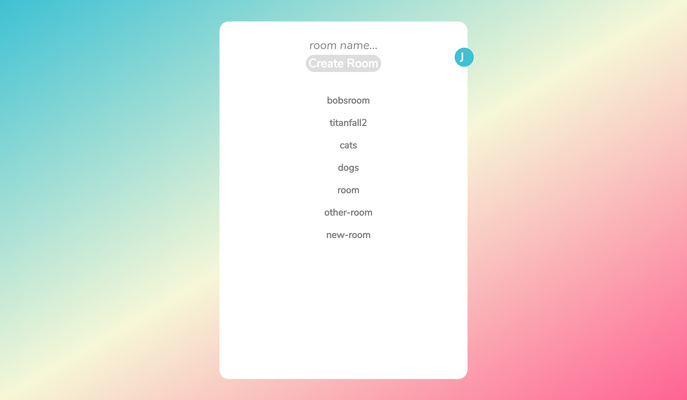
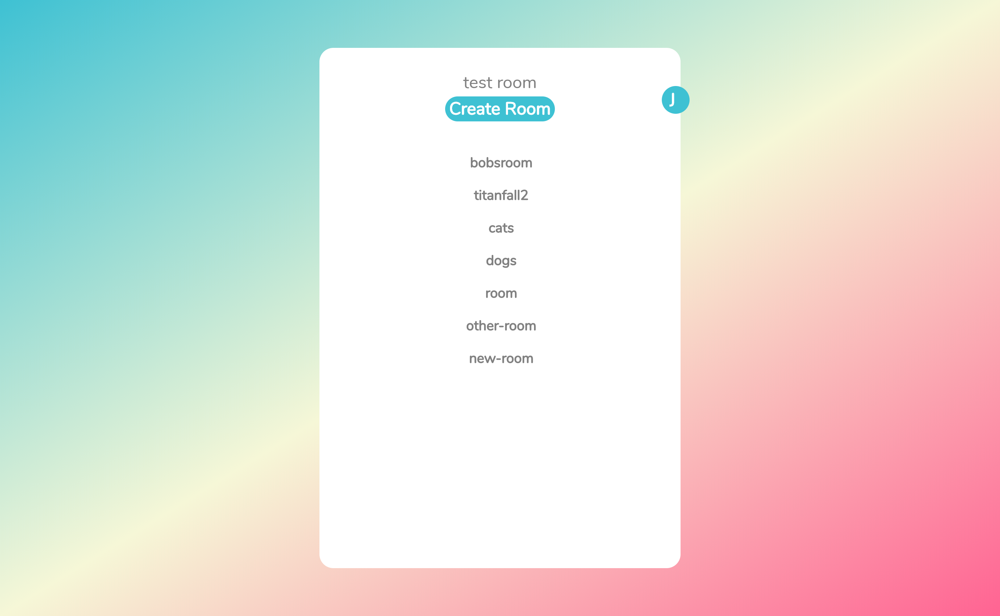
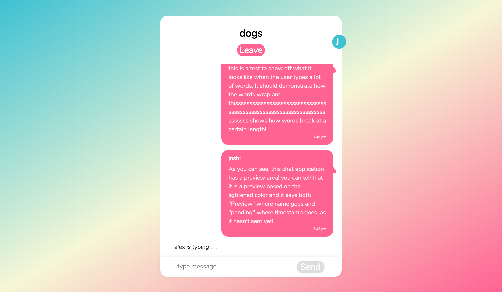
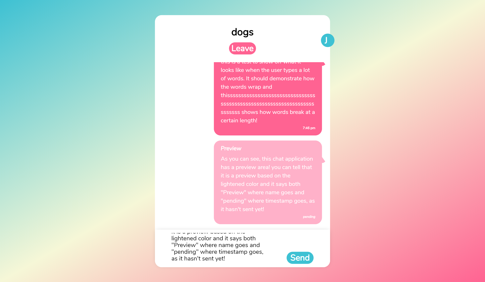

## Chatr

An easy to use chat app with clean animations and features

### Live link
Try it out: https://chat-client.joshrlear.now.sh/

### `To get things started locally`

git clone into your project folder. Make sure to git clone the client files as well: https://github.com/Joshrlear/chatr-client 
Run: "npm i" to update all depedencies
Open them both. For client-side run: "npm start". For server run : "npm run dev"

### `Api Docs`

No external api. All api makes calls to postgres database.
the database can recieve the following req methods: GET, POST, DELETE

- user enters name > GET(check for user) > POST (create if doesn't exist)

- user enters new name while in chatroom > DELETE (remove userRooms row that corresponds to user_id and rooms_id) > POST (create new userRooms row - manyToMany relational table)

- user enters room > socket.io (add user to room) > POST (create new userRooms row)

- user leaves room > socket.io (remove user from room) > DELETE from userRooms

- user creates room > socket.io (user joins room) > GET (check rooms to see if room exists) > POST (if doesn't exist, room created in rooms table) > GET (check userRooms table if userRooms connection exists) > POST (if userRooms doesn't exist, create userRooms connection)

- user types > socket.io (broadcast.emit userTyping message to all but user)

- user stops typing > socket.io (wait 3 seconds, then end broadcast.emit userTyping messasge)

- user sends message > socket.io (if exists, end userTyping message) > socket.io (broadcast.emit message: { user_id, username, rooms_id, roomName, timeStamp })

### `Built with:`

- React
- scss
- Nodejs
- postgresql
- socket.io
- deployed to zeit (front-end) & heroku (backend)

### `Features`

Chatr currently features real time messaging wtih the ability to 
change profile information from any screen accept the landing page.
Profile is accessible from most pages.

**Chatr does not require login and does not save messages. who you are**
**and what you say is your business.**

### `Future updates`

- ability to add images to profile.
- ability to send images in chat.
- the ability to create private "sidechats" inside of a group message without leavine room or current page.
To start a sidechat the sender starts a message by typing the recievers name
- switch between group chat and sidechat easily by clicking/tapping that chats icon.
- chat icons showing thumbnail of all user images to signify who is in which room
- easily see all users in chatroom with users profile thumbnail displayed at the top
of the chat.

## version

Live: v 1.0